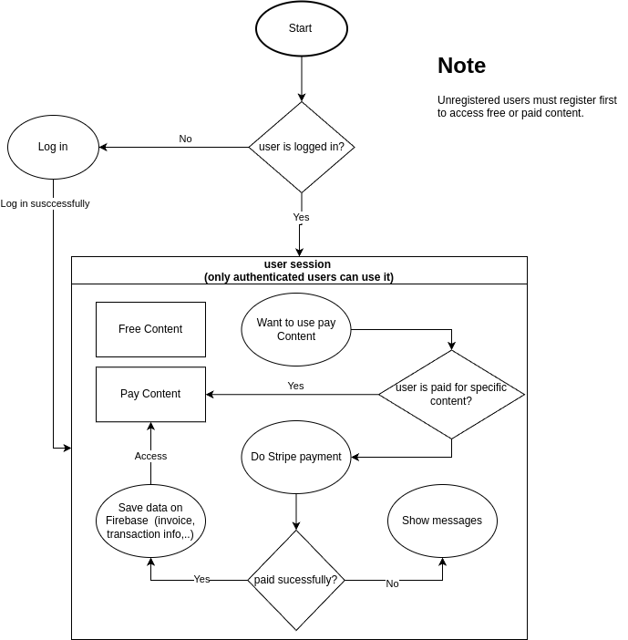

# Firebase and Stripe Payment Integration

## Description
This project is an application that integrates Firebase and Stripe payment functionality using a pure JavaScript framework. It leverages JavaScript alongside basic HTML and CSS to provide a simple yet powerful payment and authentication solution.

## Features
- **User Authentication**: Manage user sign-in and sign-up with Firebase Auth.
- **Payment Processing**: Utilize the Stripe API for secure payment transactions.
- **Data Storage**: Store and retrieve data using Firebase Firestore.
- **Cloud Functions**: Use Firebase Functions for server-side operations.

## Technologies
- **JavaScript**: Core programming language for application logic.
- **Firebase Auth**: Authentication system for managing user accounts.
- **Firebase Firestore**: NoSQL cloud database for storing data.
- **Firebase Functions**: Serverless backend for running server-side logic.
- **Stripe API**: Payment processing and transaction handling.

# Flowchart



## Project Structure
```
project-root/
|-- css/
|   |-- styles.css                    # Basic CSS styles
|
|-- functions/
|   |-- .env.js-stripe-firebase-demo # Environment configuration for Firebase Functions
|   |-- endex.js                     # Firebase function logic
|   |-- package.json                 # Node.js dependencies
|
|-- html/
|   |-- 404.html                     # Custom 404 error page
|   |-- free-content.html            # Publicly accessible content
|   |-- login.html                   # User login page
|   |-- pay-content.html             # Paid content page
|   |-- sign-up.html                 # User registration page
|
|-- js/
|   |-- authenticated-free-content.js # Logic for accessing free authenticated content
|   |-- authenticated-pay-content.js  # Logic for accessing paid authenticated content
|   |-- firebase-functions.js         # Firebase Functions interaction
|   |-- index.js                      # Core JavaScript logic
|   |-- login.js                      # Login functionality
|   |-- secret.js                     # Secret-related operations
|   |-- sign-up.js                    # Sign-up functionality
|
|-- .firebaserc                      # Firebase project configuration
|-- README.md                        # Project documentation
|-- firebase.json                    # Firebase project settings
|-- index.html                       # Main HTML entry point
```

## Acknowledgments
- [Firebase](https://firebase.google.com/) for providing a powerful backend-as-a-service platform.
- [Stripe](https://stripe.com/) for their robust payment processing API.
